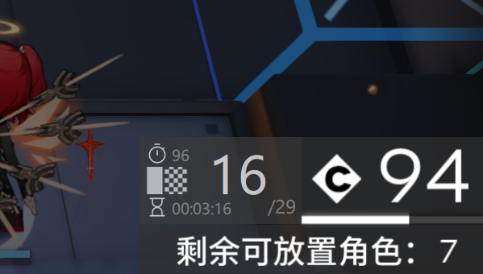

# Arknights Cost Bar Ruler (明日方舟费用条尺子)

一个为《明日方舟》设计的悬浮窗工具，基于费用条变化测量当前关卡内的帧数，帮助玩家复刻极限操作。

## 特性

- **自适应费用条速度变化**:
  - 校准系统可以轻松处理三减费，二减费等环境。
  - 快速切换不同的费用校准文件。
- **实时显示**: 几乎无延迟的悬浮窗，实时反馈当前帧数。
- **广泛的模拟器支持**:
  - **支持MuMu模拟器12截图增强**: 速度极快。
  - **通用Minicap截图方案**: 兼容绝大多数 Android 9 及以下的模拟器。
- **分辨率自适应**: 自动计算费用条位置，无需手动设置。
- **用户友好**:
  - 首次运行提供连接设置向导。
  - 自动化的校准流程。
  - 可拖动的半透明悬浮窗，不遮挡游戏画面。
  - 提供全局计时器和停表功能

## 快速开始

1.  **下载**: 前往 [Releases 页面](https://github.com/ZeroAd-06/ArknightsCostBarRuler/releases) 下载最新的发行版文件。
2.  **运行**: 直接运行 `.exe` 文件。
3.  **首次配置**:
    - 程序会弹出设置向导。
    - 选择您使用的模拟器类型。
    - 点击“保存并启动”。
4.  **首次校准**:
    - 程序启动后，悬浮窗会提示您选择配置文件。
    - 右键程序的托盘图标，选择 ` 校准配置 > -- 新建 -- `。
    - 进入任意关卡。
    - **点击一个干员（或者可选中单位，让游戏进入慢速模式）**。
    - 点击悬浮窗左侧按钮开始校准
5.  **开始使用**: 
    - 校准完成后，悬浮窗将实时显示当前帧数。
    - 悬浮窗的左下角是**全局计时器**，显示当前游戏内时间。
    - 点击全局计时器，悬浮窗的左上角会出现**停表**，显示相对帧数，再次点击全局计时器以让其消失。
    - 如果费用回复速率发生变化，需要切换配置或重新校准，请右键托盘图标，在`连接配置`选项中更换或新建配置。

## 从源码运行

1.  克隆本仓库: `git clone https://github.com/ZeroAd-06/ArknightsCostBarRuler.git`
2.  下载Minicap二进制文件: `https://github.com/openatx/stf-binaries/tree/master/node_modules/minicap-prebuilt/prebuilt` 并添加到目录 `controllers/minicap` 中。
3.  安装Python 3.8+。
4.  安装依赖: `pip install Pillow pystray ttkbootstrap websockets`
5.  运行主程序: `python main.py`

## 注意

*  该程序在以下环境下不可用: 
    - 部署费用已到达上限。
    - 部署费用无法自然回复（如剿灭作战）。
    - 部署费用自然回复被锁定（如第15章的“活性态萨卡兹术师结晶”（就是那个会发出锁链的））。
*  如果程序崩溃，或遇到极高的延迟，请: 
    - 关闭程序并重新打开。
    - 删除 `config.json` 。
    - 在 [Issue 页面](https://github.com/ZeroAd-06/ArknightsCostBarRuler/issues) 报告问题。
*  我是一个6周年入坑的小登，游戏理解只能算中杯，因此: 
    - 我没有打过合约，也不确定这是否符合极限玩家的需要。
    - 如果你觉得该项目显示的帧数与你所想的不一致，很有可能是我的问题。

## 许可 & 致谢

本项目在 `MIT License` 下开源。

本项目依赖或参考了以下优秀的开源项目，特此感谢：

- **[Minicap](https://github.com/DeviceFarmer/minicap)**: 用于通用的安卓屏幕高速截图。在 `Apache License 2.0` 下使用。
- **[Google Material Symbols](https://fonts.google.com/icons)**: 本项目使用的图标资源。在 `Apache License 2.0` 下使用。
- **[MaaFramework)](https://github.com/MaaXYZ/MaaFramework)**: 虽然本项目 **并不** 由 MaaFramework 强力驱动，但是如果没有其代码作为参考，编写 MuMu模拟器12 的适配是不可能的。`mumu.py` 模块遵循 `GNU Lesser General Public License v3.0`。

您可以在本仓库的 `LICENSE` 文件夹中找到相关协议的副本。

---